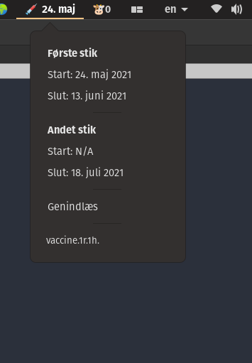

Archived: I have booked my vaccination now.

# Argos plugin for Danish COVID-19 vaccination plan

A plugin for [Argos](https://github.com/p-e-w/argos).

EXPERIMENTAL!

Hardcoded for vaccination group 10d1.

~~I have no clue whether the URL the data is pulled from is stable or
regularly updated.~~

## Troubleshooting

Not related to this plugin, but Argos itself.

I had to install a fork of Argos because of
[p-e-w/argos#120: Argos menus won't open on Ubuntu 20.04](https://github.com/p-e-w/argos/issues/120)
